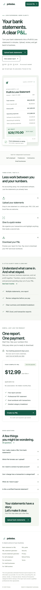
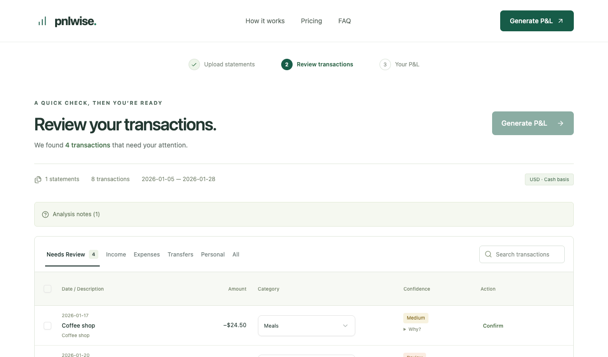
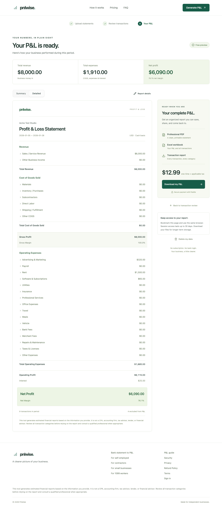
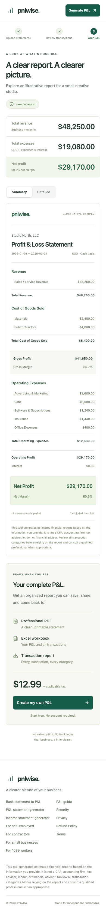
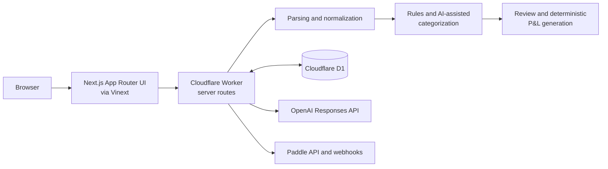

# Pnlwise

Pnlwise is an AI-assisted financial reporting SaaS that transforms CSV, XLSX, and supported text-based PDF transaction exports into structured profit-and-loss reports.

**Live product:** [pnlwise.com](https://pnlwise.com)

Built by **Dmitrii Nadtochii** as an end-to-end SaaS product covering product architecture, frontend and backend development, financial-file processing, AI-assisted categorization, payments, testing, and Cloudflare deployment.

Pnlwise helps independent businesses turn transaction exports into a reviewable cash-basis P&L without treating AI output as accounting truth. Users inspect uncertain classifications before the application calculates deterministic totals.

## Product workflow

1. Upload CSV, XLSX, or a supported text-based PDF statement.
2. Parse and normalize transactions into a consistent model.
3. Detect duplicates and identify transfer or loan patterns.
4. Apply deterministic rules and AI-assisted categorization.
5. Route uncertain classifications to the review workspace.
6. Generate P&L totals with deterministic application logic.
7. Verify payment through a signed server-side workflow.
8. Export the report as PDF, XLSX, or CSV.

AI assists with categorization. It does not calculate financial totals or control transaction amounts, report ownership, payment state, or export authorization.

## Product walkthrough

### Upload and product flow

The responsive landing experience explains the workflow, supported inputs, report preview, and one-time payment model.



### Transaction review

Low-confidence and policy-sensitive transactions are surfaced for review before report generation.



### P&L report and exports

The report presents deterministic revenue, cost, expense, and net-profit totals. Paid exports are offered from the same server-authorized report state.



The report workflow also supports a focused mobile layout.



All screenshots use synthetic demonstration data.

## Key features

- CSV, XLSX, and supported text-based PDF ingestion
- Transaction parsing, validation, and normalization
- Duplicate detection across uploaded statements
- Transfer matching and loan principal/interest handling
- Deterministic rules with server-side AI-assisted categorization
- Confidence thresholds and manual review for uncertain transactions
- Deterministic cash-basis P&L generation using integer-cent arithmetic
- Paddle Checkout with signed, idempotent webhook fulfillment
- Server-side paid-export authorization
- PDF, XLSX, and CSV exports
- Temporary report retention and user-triggered data deletion
- Upload, processing, AI, event, and export abuse controls

## Architecture



- **Application:** Next.js 16 App Router architecture through Vinext, React 19, TypeScript, Vite, and Tailwind CSS
- **Runtime:** Cloudflare Worker server routes
- **Data:** Cloudflare D1 with Drizzle schema and migrations
- **AI:** OpenAI Responses API with strict structured output and Zod validation
- **Payments:** Paddle Checkout and signed webhooks
- **Optional authentication:** Supabase SSR authentication with PKCE and HttpOnly cookies

Financial amounts are stored and calculated as integer cents. D1 writes use prepared statements, optimistic revisions, ownership checks, and conditional updates for security-sensitive state transitions.

## AI and privacy boundary

- Uploaded source files are processed in memory and are not intentionally retained as raw documents.
- Normalized transactions and report state are stored temporarily according to the configured retention period.
- OpenAI requests are made only from server-side code.
- OpenAI receives selected transaction fields, not the uploaded source document.
- Descriptions are truncated and long numeric sequences are redacted before eligible transactions are sent for categorization.
- Requests use `store: false`, strict structured output, exact transaction-ID matching, and Zod validation.
- Missing, malformed, or low-confidence AI results fall back to manual review.
- AI cannot alter source amounts, transaction directions, report totals, ownership, or payment state.

These controls minimize data exposure but do not claim complete anonymization or regulatory certification.

## Payment and export security

The deployed product uses Paddle Live for its active one-time payment flow.

- The browser receives only the intended public Paddle client configuration and server-created transaction ID.
- Paddle API credentials and webhook signing material remain server-side.
- The webhook handler verifies the signed raw request body with the Paddle SDK.
- Fulfillment checks the stored transaction, report/payment identifiers, selected catalog item, quantity, amount, currency, environment, and completed payment state.
- Conditional D1 updates make duplicate webhook delivery idempotent.
- Checkout success redirects and client events never mark a report as paid.
- Export endpoints independently enforce ownership, paid status, completed report state, and resolved review items.

The repository also retains an inactive Stripe Test Mode rollback path. It is not connected to the active checkout UI or checkout API and rejects live Stripe events.

## Testing and quality

Current verified baseline:

- **178 automated tests passing** across parsing, normalization, deduplication, transfers, loans, AI validation/fallbacks, D1 atomicity, payments, retention, authorization, and exports
- **6/6 Playwright E2E tests passing** against an isolated local Worker and D1 database
- ESLint: pass
- TypeScript typecheck: pass
- Staging build: pass
- Production build: pass
- Production dependency audit: **0 critical / 0 high**

Tests use the Node.js test runner, Playwright, Miniflare, and local Cloudflare D1 tooling. This evidence is automated validation, not a penetration test or security certification.

## Synthetic financial fixtures

All committed financial QA fixtures were created for testing and contain no real customer financial data:

- `tests/fixtures/01_January_Statement.csv`
- `tests/fixtures/02_February_Statement.xlsx`
- `tests/fixtures/03_March_Statement.pdf`
- `tests/fixtures/business.csv`

They exercise multiple periods, file formats, categorization cases, duplicate detection, transfers, loans, and export calculations.

## Tech stack

| Area | Technologies |
| --- | --- |
| Frontend | React 19, TypeScript, Tailwind CSS, Base UI/Radix primitives |
| Application | Next.js 16 App Router architecture, Vinext, Vite |
| Runtime | Cloudflare Workers |
| Data | Cloudflare D1, Drizzle ORM |
| AI | OpenAI Responses API, structured outputs, Zod |
| Payments | Paddle Checkout, Paddle Node SDK, signed webhooks |
| Files and exports | Papa Parse, ExcelJS, unpdf, pdf-lib, JSZip |
| Testing | Node.js test runner, Playwright, Miniflare |

## Local development

### Requirements

- Node.js `>=22.13.0`
- npm
- Google Chrome for Playwright E2E tests

### Install and configure

```sh
npm ci
cp .env.example .env.local
```

Keep real credentials only in the ignored `.env.local` file. The checked-in example contains placeholders and documents the available public and server-only settings. Core rules-based processing works without OpenAI or payment credentials; integrations fail closed when not configured.

### Local D1 runtime

Build the staging Worker, apply the tracked migrations to an isolated local D1 database in order, then start the local Worker:

```sh
npm run build:staging
npx wrangler d1 execute pnlwise-staging --local --config dist/server/wrangler.json --persist-to .wrangler/state --file drizzle/0000_kind_morlun.sql
npx wrangler d1 execute pnlwise-staging --local --config dist/server/wrangler.json --persist-to .wrangler/state --file drizzle/0001_low_madame_hydra.sql
npx wrangler d1 execute pnlwise-staging --local --config dist/server/wrangler.json --persist-to .wrangler/state --file drizzle/0002_high_liz_osborn.sql
npm run start
```

Use only local or sandbox provider credentials during development.

### Quality commands

```sh
npm run lint
npm run typecheck
npm test
npm run build:staging
npm run build
```

With the local Worker running:

```sh
PLAYWRIGHT_BASE_URL=http://127.0.0.1:8787 npm run test:e2e
```

Production deployment configuration is retained for maintainers but intentionally omitted from this portfolio-oriented setup guide.

## Limitations

- PDF support targets supported text-based statement layouts. Scanned documents require OCR, which is not implemented.
- Encrypted, damaged, ambiguous, partially extracted, formula-driven, or macro-enabled files are rejected with guidance to use CSV/XLSX where appropriate.
- The generated output is an estimated cash-basis financial report, not audited or certified accounting work.
- Transaction review remains necessary because bank descriptions may not establish the correct business treatment.
- Optional OpenAI, Paddle, Supabase, monitoring, and email/provider behavior requires separately configured services.

## Source availability

This source is published for portfolio and code-review purposes. No license is granted to reuse, redistribute, or commercially exploit the project code unless separately permitted by the owner. Third-party packages, components, fonts, and other dependencies remain subject to their respective licenses and notices.

## Implementation references

- [Paddle Checkout](https://developer.paddle.com/build/checkout/build-overlay-checkout)
- [Paddle webhook signatures](https://developer.paddle.com/webhooks/signature-verification)
- [OpenAI Structured Outputs](https://developers.openai.com/api/docs/guides/structured-outputs)
- [Supabase server-side authentication](https://supabase.com/docs/guides/auth/server-side/creating-a-client)
- [unpdf](https://github.com/unjs/unpdf)
- [ExcelJS](https://github.com/exceljs/exceljs)
